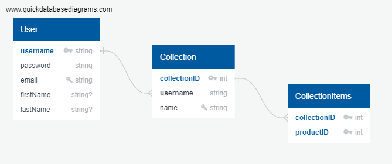
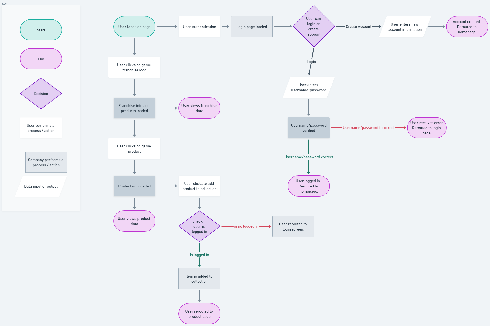
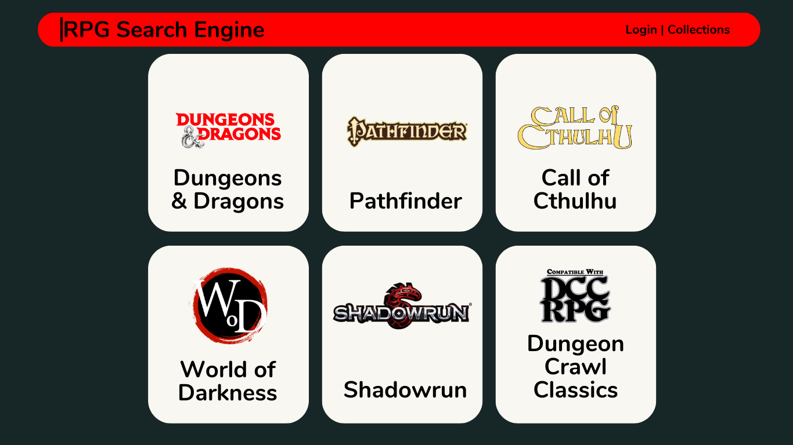
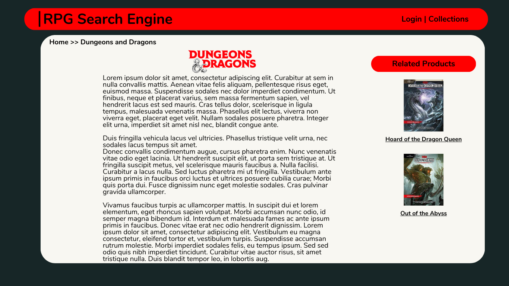

# RPG SEARCH ENGINE PROPOSAL #

## Introduction ##

The RPG Search Engine is a project meant to allow users to find information on different roleplaying game franchises/editions, view the various products available for that roleplaying game, and create/share lists of games and products with other users.

Game and product data will be pulled from the BoardGameGeek (BGG) XML API and converted into JSON for this project. This will include information on game franchises and data on individual products within each franchise.

The project will be completed using React Router for the front end, Node/Express for the backend, and PostgreSQL for the database. The PostgreSQL database will house tables for user data and their saved game collections/wishlists.

## Features ##

- View information about roleplaying game systems and settings

- View information about single products that are produced for specific game systems

- Create and share collections of products

- Suggest items with similar game systems or genres for users to discover new games

## Stretch Goals ##

- Connect with Amazon Product API to automatically generate affiliate links for users to purchase products on Amazon

- Scrape data from BGG API to create own product database and API

- Allow users to add systems and products to database

## Database Design ##

The database will be relatively simple, with tables for Users, Collections, and CollectionItems (products that are in each collection). ProductID information will come from IDs used in BGG API.

## User Flow ##

## Home Page Mockup ##

## System Page Mockup ##

